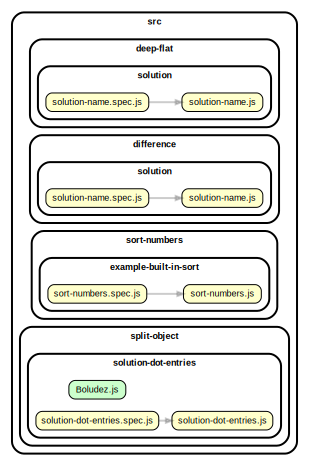

<!-- BEGIN TITLE -->

# DOCS

<!-- END TITLE -->

<!-- BEGIN TREE -->

> [interactive graph](./dependency-graph.html)



<!-- END TREE -->

<!-- BEGIN TOC -->

- deep-flat
- difference
  - arrayDifference
    - [array-difference.js](#srcdifferencearrayDifferencearray-differencejs)
- intersection
- sort-numbers
  - example-built-in-sort
    - [sort-numbers.js](#srcsort-numbersexample-built-in-sortsort-numbersjs)
- split-object

---

<!-- END TOC -->

---

<!-- BEGIN DOCS -->

# /deep-flat

---

# /difference

## /arrayDifference

<details><summary><a href="../../src/difference/arrayDifference/array-difference.js" id="srcdifferencearrayDifferencearray-differencejs">../src/difference/arrayDifference/array-difference.js</a></summary>

<a name="arrayDifference"></a>

## arrayDifference ⇒ <code>Array.&lt;Array&gt;</code>

Compares the items in the firstArray against the the secondArray and returns the values which are in the firstArray but not in the secondArray.

**Returns**: <code>Array.&lt;Array&gt;</code> - [newArray=[]] - The new array that embraces items(difference) which are found in
the first array but not in the second to be compared.

| Param         | Type                             | Default         | Description                               |
| ------------- | -------------------------------- | --------------- | ----------------------------------------- |
| [firstArray]  | <code>Array.&lt;Array&gt;</code> | <code>[]</code> | The first array of items to be compared.  |
| [secondArray] | <code>Array.&lt;Array&gt;</code> | <code>[]</code> | The second array of items to be compared. |

**Example**

```js
arrayDifference([1, 2, 3, 4][(1, 3, 4, 5)]); // [2]
```

</details>

---

---

# /intersection

---

# /sort-numbers

## /example-built-in-sort

<details><summary><a href="../../src/sort-numbers/example-built-in-sort/sort-numbers.js" id="srcsort-numbersexample-built-in-sortsort-numbersjs">../src/sort-numbers/example-built-in-sort/sort-numbers.js</a></summary>

<a name="sortNumbers"></a>

## sortNumbers ⇒ <code>Array.&lt;number&gt;</code>

Sorts an array of numbers from smallest to largest.

Returns a new array without modifying the original array.

Does not need to support: NaN, Infinity, -Infinity.

**Returns**: <code>Array.&lt;number&gt;</code> - A new array with the same numbers, but sorted.

| Param          | Type                              | Default         | Description                   |
| -------------- | --------------------------------- | --------------- | ----------------------------- |
| [arrOfNumbers] | <code>Array.&lt;number&gt;</code> | <code>[]</code> | The array of numbers to sort. |

**Example**

```js
sortNumbers([1.5, 1, -1.5, 0, -1]);
// -> [-1.5, -1, 0, 1, 1.5]
```

**Example**

```js
sortNumbers([-1, 0, 1]);
// -> [-1, 0, 1]
```

</details>

---

---

# /split-object

---

<!-- END DOCS -->
